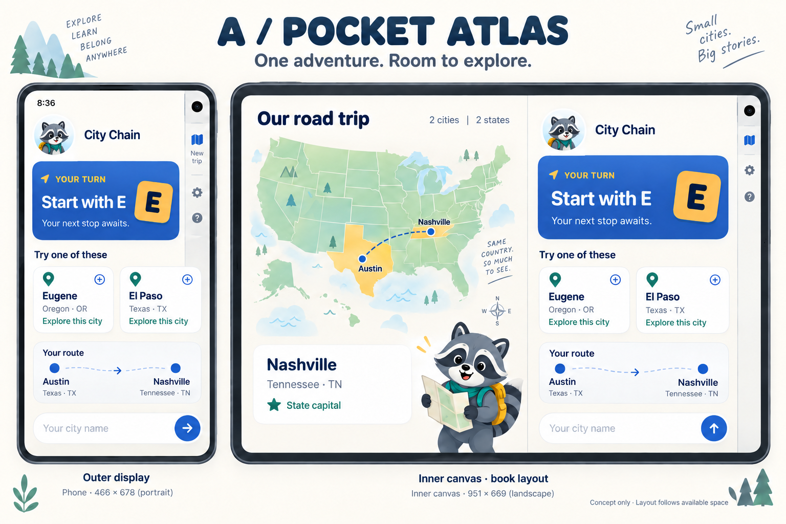
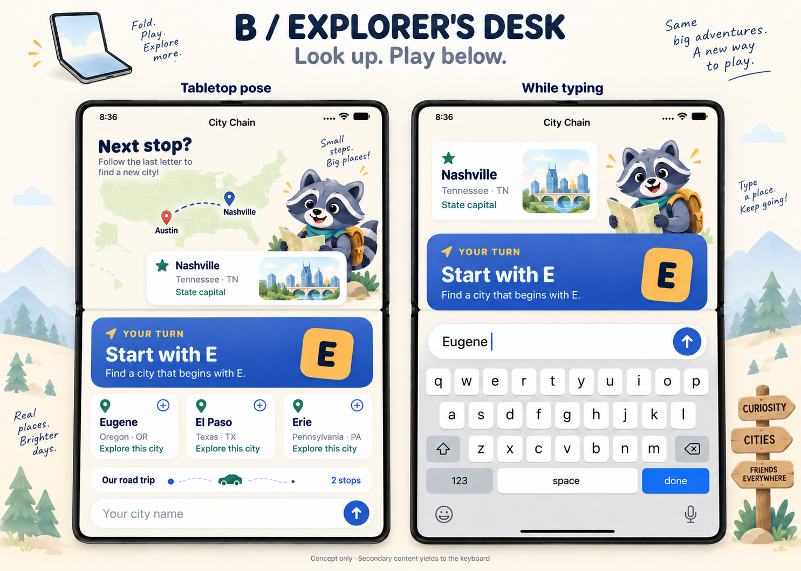

# City Chain — iPhone Duo concepts

Date: 2026-09-27. Status: **proposal for discussion, not an approved implementation**.

Scope: research, mascot roadmap and graphic mockups. No Swift source, target settings, dependencies or app behavior are changed in this task. The user will choose a direction before implementation.

## Recommendation

Use **Pocket Atlas** as the primary expanded composition: gameplay and a companion atlas stay visible together. Use **Explorer's Desk** as a posture-aware variation when the device is placed on a table. These can be two presentations of the same game rather than separate modes the child must configure.

The extra space has an educational job: show where the last city is and which state it belongs to. Keep the next letter, suggestions and submission action visually dominant. Scout connects the two areas without covering controls.

## Research: what is actually available

### Apple sources

| Source | Verified finding | Design consequence |
| --- | --- | --- |
| [Get ready for iPhone Duo](https://developer.apple.com/iphone-duo/) | Apple provides Duo guidance, Xcode 27.1 beta resources, Q&As and specialist Tech Talks. | Use current Duo guidance rather than extrapolating from older iPhone layouts. |
| [Design for iPhone Duo](https://developer.apple.com/videos/play/tech-talks/111466/) | The outer display is shorter/wider than a traditional iPhone. System controls can sit along the side. Folded tabletop poses favor accessible controls in the lower region. | Leave space for side bars; consider an upper discovery area and lower interaction area. |
| [Prepare your app for iPhone Duo](https://developer.apple.com/videos/play/tech-talks/111461/) | Outer size classes vary with orientation; the inner display is regular/regular. Layout should follow local geometry and size classes, not device idiom or orientation. Safe areas may be asymmetric. Building with the 27.1 SDK enables full use of the display. | Preserve state through resize, respect each edge independently, and do not infer usable dimensions from screen model names. |
| [Strike a pose with adaptive layouts](https://developer.apple.com/videos/play/tech-talks/111463/) | iOS 27.1 adds `ArrangementView` with split/overlay arrangements. `GeometryProxy.reservedRegions(kind:)` exposes division and occlusion regions; inactive division regions can also be queried. | A split arrangement is a strong candidate for game + atlas. Keep related controls together and clear of an active fold. |
| [Leverage multiple displays and scenes](https://developer.apple.com/videos/play/tech-talks/111464/) | Display/scene behavior and hinge-driven interactions have dedicated APIs; hinge interaction and adaptive layout are distinct concerns. | Opening the device should continue the same game. Optional fold effects for Scout can be considered later. |

Also located the [Duo Human Interface Guidelines](https://developer.apple.com/design/human-interface-guidelines/designing-for-iphone-duo). The web text extractor could not read their JavaScript content, so the findings above rely on the readable official Tech Talk transcripts, not an assumed reading of the HIG.

### Skills inspected

- `swiftui-layout-components`: adaptive containers, scrolling and keyboard-safe input placement.
- `swiftui-navigation`: distinguishes navigation columns from related custom content panes.
- `swiftui-whats-new-27`: useful SDK 27 guidance, but the installed copy has no Duo-specific material.
- **`app-resizability` from Xcode 27.1:** freshly exported using `xcrun agent skills export --output-dir /tmp/city-chain-xcode271-skills`. The existing global skills were not changed.

The exported skill explicitly covers Duo and SwiftUI. Its `references/safe-area-task.md`, lines 213–258, explains that SwiftUI geometry is already constrained by its offered region: do not subtract/reapply safe-area insets. It distinguishes `safeAreaBar`, `safeAreaInset`, and design padding; `toolbarVerticalEdge` is available in iOS 27.1 when custom UI needs to know the vertical bar edge. Its orientation and idiom references favor local layout information over hardware-based branches.

Only the skill's research guidance is applied now. Its code-migration workflow is deferred under the user's explicit instruction not to program yet.

### Local Simulator evidence

Read from `/Library/Developer/CoreSimulator/Profiles/DeviceTypes/iPhone Duo.simdevicetype/Contents/Resources/capabilities.plist`, nested under `capabilities.displays`:

| Profile screen | Pixels | Scale | Derived logical dimensions | Native orientation value |
| --- | --- | --- | --- | --- |
| 1 / `primary` / `LCD` | 1398 × 2034 | 3 | 466 × 678 pt | 0 |
| 3 / `primary-1` / `LCD-1` | 2007 × 2853 | 3 | 669 × 951 pt | 270 |

The profile's `profile.plist` specifies minimum runtime 27.1. The profile does not label these entries “outer” and “inner,” nor supply usable safe-area rectangles for each pose. Mockups use the smaller panel for the compact outer composition and the larger panel for the expanded inner composition, consistent with the user's description and the previously observed compact preview. These are design canvases, not constants to encode in app layout. The larger canvas is rotated for the book layout.

## Concept A — Pocket Atlas

**Outer:** a focused turn card, compact Scout avatar, suggestions and an input. The trip/atlas remains reachable through a secondary destination. Preserve room for the top-right camera and side controls; exact placement is illustrative until checked in Device Hub.

**Inner, open/book:** the atlas occupies one pane; the active turn occupies the other. In the sample, Austin → Nashville has been played, so the next letter is E. The atlas shows the latest city, full state name and abbreviation, and a state-capital badge. Scout holds a map beside the discovery card.

The gameplay pane includes suggested E cities and the input. In a book pose, put controls in a coherent region, favoring continuity toward the outer-display experience. Do not spread one card, word, or text field across the fold. Pane widths and gaps follow live available regions; no permanent artificial hinge gap when flat.

**Why this is the preferred starting point:** the child can answer and learn the location at the same time. It expands the current screen naturally, with little new interaction to learn.

**Tradeoff:** city locations require reliable data. The current catalog provides state metadata, not a complete map/coordinate dataset. A production map needs an explicit data source and attribution plan.

## Concept B — Explorer's Desk

**Tabletop:** upper region presents the atlas, latest city and Scout. Lower region holds the next-letter prompt, large suggestions and input. This creates a small learning desk when the phone rests on a surface.

**Typing:** keep the next letter and active input visible. The map and history yield space; input sits immediately above the system keyboard within available geometry. This is a separate visual state, not an instruction to shrink everything proportionally. Exact keyboard placement must be verified in Device Hub before implementation claims.

**Tradeoff:** posture transitions and keyboard space need more care than the flat split. Avoid jumps between panes during a turn or dragging the current focus away. If usable space is insufficient, present one focused scrollable game area.

## Shared behavior contract for a later prototype

- One game/session model owns the city chain, pending request, turn, input draft and selected city across display transitions.
- Atlas selection is a preview/detail interaction; it must not silently submit a city.
- Core information remains available in the compact layout. Expansion reveals companion content, not exclusive rules or required controls.
- Dynamic Type can collapse a split when the contents no longer fit. Do not make text smaller to keep two columns.
- Use native navigation for destinations. Evaluate `ArrangementView` for simultaneous game + atlas content; do not nest it in a scrolling container or use it as a navigation replacement.
- Gate 27.1-only APIs and retain a compatible presentation for the current iOS 17 app target. Building with a new SDK does not require raising the deployment target.
- Keep Reduce Motion and VoiceOver support. Scout's animation is optional; important feedback remains text.
- Avoid claiming geographic driving routes: connectors show the order of game turns.

## Proposed data and illustration scope

Existing: city names, states, abbreviations, capital flags, turn sequence.

Proposed: reliable city coordinates/state boundaries, atlas selection, Scout art and animation. Any richer city facts or collectible passport should be a later separately scoped addition. Do not invent facts to fill the wide screen.

## Review and verification after approval

1. Choose the base composition and Scout art direction.
2. Prototype outer, flat inner, book and tabletop arrangements using one game session.
3. Check display transitions with an unfinished input, pending reply and selected city.
4. Check keyboard, sidebars on either edge, split-screen resizing, large text, VoiceOver and Reduce Motion.
5. Evaluate on iPhone Air as well as Duo; the ordinary phone must remain a first-class experience.

## Graphic artifacts

These generated concept illustrations are not Simulator screenshots or validated Apple system layouts. Device-frame proportions, maps and system-chrome details are illustrative; the production implementation must use verified geography and system-provided geometry. The labeled point dimensions describe the Simulator canvases, not measured dimensions of the drawn frames.

### A — Pocket Atlas

Outer display: a focused game. Inner display: an atlas alongside the active turn and city suggestions.

### B — Explorer's Desk

Tabletop presentation: exploration above, touch controls below. While typing, secondary content yields to the keyboard and the next letter stays visible.

The [exact generation and correction prompts](CITY_CHAIN_DUO_IMAGE_PROMPTS.md) are stored alongside the boards for iteration. Built-in `image_gen` was used; no app UI code was generated. Suggestion-city capital badges were corrected during visual review; Nashville retains its capital marker.
