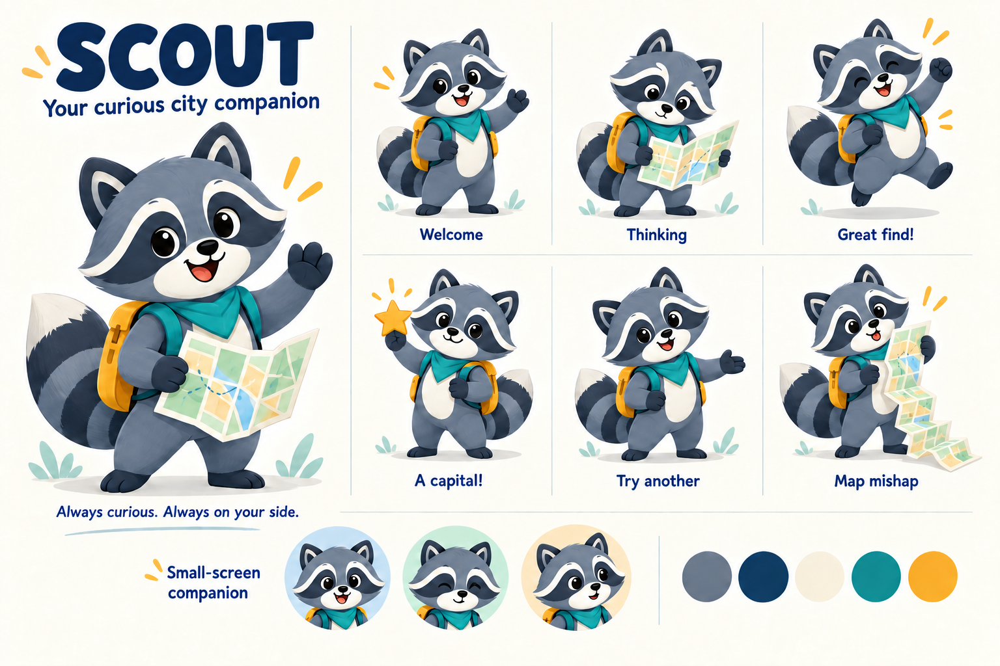

# Scout — character direction

Updated: 2026-09-27.

Status: initial sprite integration implemented after the product owner's go-ahead. City Chain builds successfully through Xcode Tools MCP for iPhone Air Simulator. Final device and animation review remain pending.

## Role

Scout is the child's curious traveling companion in City Chain. They collect cities in a folding atlas, celebrate discoveries and offer another path after a mistake. Their personality is attentive, playful and encouraging.

The folding map gives Scout a small recurring joke: sometimes there is more map than raccoon. The joke is at Scout's expense, never at the child's.

## Visual identity

- Slate blue-gray raccoon with a dark eye mask, cream muzzle and expressive ears.
- Large rounded head, compact body and a clearly banded curved tail.
- Teal neckerchief and amber backpack connect Scout to the existing City Chain palette.
- A folding paper map is the signature prop. Its lines are decorative, not geographic claims.
- Crisp 2D illustration with restrained shading. Avoid realistic fur, tiny ornamental details and lettering baked into the character.
- Keep eye-mask shape, facial proportions, outfit and tail pattern consistent across poses.

## Expression vocabulary

| Pose | Intent | Suggested motion after approval |
| --- | --- | --- |
| Welcome | Invite the child to begin | One small wave on entry |
| Thinking | Explore possible next stops | Look down at the map; avoid a restless continuous loop |
| Great find! | Celebrate an accepted city | Brief lift or nod |
| A capital! | Highlight a state-capital discovery | Present a small star |
| Try another | Offer help with a rejected or repeated city | Gentle head tilt and open paw |
| Map mishap | Add occasional personality outside critical input | An accordion fold opens farther than intended |

Reactions must not delay a turn. Use the capital pose only when the city data confirms a state capital. Map mishap is optional decoration, never an error or loading indicator.

## Presentation sizes

1. **Compact avatar:** a head-only portrait beside a short game message; remove small map/backpack details rather than shrinking a whole illustration. The first sprite set uses this simpler silhouette instead of the concept sheet's bust.
2. **Companion pose:** full body beside exploration content on a spacious layout.
3. **Celebration:** a short pose change within the same reserved space, keeping controls stable.

The concept board's avatar row is an illustration study. It does not establish readability at actual device sizes; that needs a later in-app check.

## Production plan after visual approval

1. Freeze the hero silhouette and face, then prepare front, side and three-quarter reference views.
2. Create four first-release poses: welcome, thinking, celebration and try another, plus a compact avatar.
3. Use a layered master with independent eyes, ears, head, paws, body, tail and map if articulation is needed. A generated raster sheet is a concept reference, not a layered vector master or animation rig.
4. Export separate transparent assets with consistent bounds and anchors; never ship labels or the presentation board as a game asset.
5. Connect poses to explicit presentation state. Keep important text in accessible SwiftUI labels; hide purely decorative art from VoiceOver and provide static poses for Reduce Motion.

## Planned SwiftUI implementation

Status: first version implemented using the plan below. Articulated layers remain deferred.

### First version: individual sprites

- Store separate transparent PNG pose images in Asset Catalog, with appropriate resolution variants. Keep canvas dimensions, character scale and foot anchor consistent across full-body poses.
- Render through `Image`, `.resizable()` and `.scaledToFit()` inside a stable layout frame.
- Use `ZStack`, `.transition(.opacity)` and `withAnimation` for short pose changes. Crossfading images is not limb interpolation; inspect transitions for distracting double silhouettes.
- Use `.offset()`, `.rotationEffect()` and `.scaleEffect()` for restrained whole-character movement.
- Use triggered `keyframeAnimator(initialValue:trigger:content:keyframes:)` for welcome, thinking, celebration and try-another reactions. Independent height, rotation and scale tracks return to a neutral transform.
- Use an untriggered `phaseAnimator` for a gentle idle breath and sway: two 2.8-second phases, 1.8% scale change and a one-degree tilt in either direction. Pause when outside the scroll viewport or when the scene is inactive.

Apple reference: [Controlling the timing and movements of your animations](https://developer.apple.com/documentation/swiftui/controlling-the-timing-and-movements-of-your-animations).

### Presentation contract

`Game event → ScoutPresentation (pose + reaction identifier) → ScoutView (image + triggered animation)`

- Keep game rules outside `ScoutView`. Presentation mapping selects a pose from the game outcome.
- Advance the reaction identifier for each new event so consecutive successes and rejected submissions replay their reactions even when the pose stays the same.
- Preserve the presentation state across adaptive layout changes; resizing or folding alone must not replay a reaction.
- Event reactions finish; a restrained idle continues while the character is visible and the scene active. No explicit polling timer is used. Reduce Motion renders a static sprite.
- Read `@Environment(\.accessibilityReduceMotion)` and choose static poses instead of transforms when enabled. Keep important feedback in ordinary accessible text and mark decorative artwork with `.accessibilityHidden(true)`.

### Later: articulated layers

For independent waving, blinking or tail motion, prepare separate limb/face layers with shared bounds and explicit pivot points. Assemble using `ZStack` and rotate limbs with `rotationEffect(_:anchor:)`. Whole-pose PNGs cannot supply this motion by themselves. Defer layered artwork and articulation until the basic sprite presentation is approved and useful.

### Delivery checklist

- [x] Proceed with the reviewed character direction and initial sprite integration.
- [x] Prepare the first four transparent poses and the compact avatar; see [sprite assets and review notes](ScoutSprites/README.md). Final edge polish and device review remain pending.
- [x] Integrate stable framing, explicit presentation state and short pose transitions.
- [x] Add the triggered celebration and Reduce Motion behavior (runtime accessibility review remains pending).
- [ ] Review actual-size readability, consecutive reactions, layout transitions and idle behavior on device.
- [ ] Decide whether articulated layers are worth a second phase.

## Review checklist

- [ ] Face feels curious and friendly, including the corrective reaction.
- [ ] Character is recognizable without the backpack or map.
- [ ] Main proportions and outfit stay consistent across poses.
- [ ] Avatar silhouette remains clear at actual display sizes.
- [ ] Production art can be placed without covering controls or entering unsafe regions.

## Initial integration evidence

- Xcode Tools MCP `BuildProject`: successful for the active iPhone Air Simulator destination on 2026-09-27.
- Xcode Tools MCP `RenderPreview`: successful; the preview renderer selected iPhone Duo (iOS 27.1), despite the build destination being Air. [Actual first-stop preview](Images/scout-first-stop-preview.png).
- Scout fits beside the heading in this static preview. It is not evidence of physical-device installation, repeated reaction timing or Reduce Motion behavior.
- Tests were not run for this change.
- Additional native previews rendered successfully on Duo: [Scout component and avatar](Images/scout-component-preview.png), [main screen at accessibility1 Dynamic Type](Images/scout-large-text-preview.png). The larger-text header stacks vertically and the page remains scrollable above the fixed input area; these are static observations, not an interaction test.
- Physical iPhone Air launch was attempted through Xcode Tools MCP but blocked before installation by renewed approval required for `SpecificationCoreMacros`. The owner deferred device launch while away from the Mac. Resume only after the macro has been enabled in Xcode; no approval bypass was applied.

## Character sheet

Created with built-in `image_gen`; see [generation prompts and review notes](SCOUT_IMAGE_PROMPTS.md). The Thinking pose was corrected after the initial generation introduced an extra front paw. No app source changes are part of this step.

## Follow-up after device feedback

- Added visible welcome/rejection reactions and idle motion; repeated errors receive a new reaction identifier. Corrective motion now lasts 2 seconds, including a 0.7-second hold in the questioning tilt; the try-another sprite stays until another presentation event. Thinking appears only after 300 ms and its pending task is cancelled when the submission finishes, avoiding a transient sprite on immediate local rejections. Game results are not delayed.
- Turn feedback initially moved above the input. Subsequent device review showed this stole too much room from the route: successful messages now scroll with the game, while compact errors remain beside the composer. Both can be closed or swiped away; long input errors have a scrollable fallback.
- Removed the narrow landscape width cap and extended the backdrop through container safe areas. Wide windows use two content columns; accessibility text sizes retain a single column.
- Added the always-available City atlas; its map phase is tracked in the roadmap.
- Xcode Tools MCP build passed for these changes on 2026-09-27. Automated Simulator interaction could not be completed: Xcode Tools installed/launched the app but then rejected its own interaction session key. Animation timing, repeated errors and keyboard behavior still need live review.
