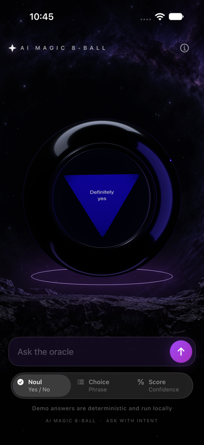

# SwiftDecision Examples

Small applications that demonstrate model decisions composed with `SpecificationCore` rules.

## OracleBallApp

OracleBallApp is an iOS 26 SwiftUI and RealityKit Magic 8 Ball rendering demo.
It uses a deterministic local answer for the presentation flow and keeps the
rendering boundary ready for a future SwiftDecision provider. The scene uses
procedural geometry, a depth-layered open shell, a textured triangular answer
plate, and a custom Metal absorption effect. See
[`DOCS/ORACLE_RENDERING.md`](DOCS/ORACLE_RENDERING.md) for the scene ownership,
run instructions, lifecycle, geometry, material limits, and validation record.



Open `CityChainApp.xcodeproj`, select the **OracleBallApp** scheme, and run on
an iOS 26+ simulator or device. Use the arrow to replay; the engine infers
whether the question needs a Noul, Choice, or Score answer. No API key is needed
for the offline fixture.

## City Chain

City Chain is an offline-testable game engine for a US cities word chain. The player may enter any city name; Noul checks whether it is a US city. The built-in catalog is only used for computer replies and contains the 50 state capitals plus 50 additional large cities.

The engine composes Core rules to reject empty input, enforce the current starting letter, prevent reuse, filter computer replies, and route between no reply, one automatic reply, and a model-selected reply. SwiftDecision uses Noul for player-city validation and Choice to select among at most five legal candidates, taken in stable catalog order. If Choice inference fails, the engine randomly selects from those same candidates. Noul abstentions remain visible as game outcomes, while Noul errors still propagate without partially committing a turn.

The game engine has no UI or live model requirement, so its rule combinations run offline with a deterministic request/response backend:

```sh
swift test
```

The engine package supports iOS 13+ and macOS 10.15+. A SwiftUI example app can use it as its domain layer.

## Optional TypeSafe Jev backend

The package resolves [`SwiftJev 0.1.0`](https://github.com/SoundBlaster/SwiftJev/releases/tag/0.1.0), [`SwiftDecision 0.3.0`](https://github.com/SoundBlaster/SwiftDecision/releases/tag/0.3.0), and [`SpecificationCore 2.0.0`](https://github.com/SoundBlaster/SpecificationCore/releases/tag/2.0.0). The game remains offline by default; choose the hosted provider explicitly through `CityChainBackendFactory` when a caller has configured a key:

```swift
let backend = try CityChainBackendFactory.makeJev(apiKey: apiKey)
let game = CityChainGame(decisions: DecisionEngine(backend: backend))
```

`makeJev` performs configuration validation and does not send a request during initialization. Keep the API key outside source control and inject it from the app's development or deployment secret configuration. The existing SwiftUI app uses the offline backend until its `AppDependencies` is constructed with a live backend.

OracleBallApp exposes the same opt-in path through `JevOracleBackend` while keeping
the `OracleGameEngine` API unchanged:

With the default `.automatic` mode, `OracleGameEngine` routes boolean questions
through a Jev-backed intent classifier. The classifier selects Noul for yes/no
questions, Score for likelihood questions, and Choice only when the question
contains explicit alternatives. Choice options are extracted from alternatives
such as “tea or coffee” or “tea, coffee, or juice”, then validated through Core
specifications before the model selects one. The classifier is instructed never
to invent options. Factual, open-ended, malformed, or absurd questions (for
example, “What is the capital of Paris?”) use the distinct Unsupported fallback
with a short varied phrase such as `Who knows?` or `The stars are silent.`;
they do not trigger a fabricated Choice request. Classifier
abstention remains an abstention when fallbacks are disabled, and provider
errors still propagate as errors.

```swift
let backend = try JevOracleBackend(
    apiKey: ProcessInfo.processInfo.environment["TYPESAFE_API_KEY"],
    model: "jev-latest"
)
let oracle = OracleGameEngine(backend: backend)
let outcome = try await oracle.answer(
    for: OracleRequest(question: "Will it work?")
)
```

Initialization only validates configuration. Use an injected `JevHTTPTransport`
for deterministic tests; live calls remain caller opt-in and are never required
by the default build or test suite.
